# [BÀI TẬP 3] TRIỂN KHAI PRODUCT SERVICE & BEAN VALIDATION

## XÂY DỰNG DỊCH VỤ QUẢN LÝ SẢN PHẨM ĐỘC LẬP, BẢO VỆ TOÀN VẸN DỮ LIỆU ĐẦU VÀO VỚI JAKARTA BEAN VALIDATION VÀ ÁNH XẠ LỖI 400 BAD REQUEST

> **Đề bài:** Khởi tạo project Spring Boot tên là `product-service` chạy trên port `8082`. Database: Tạo database `product_db` trong PostgreSQL.
> Cấu trúc mã nguồn:
> - **entity:** `Product` (`id`, `name`, `price`, `stockQuantity`, `description`).
> - **dto:** `ProductRequestDTO` và `ProductResponseDTO`.
>   - Ràng buộc Validation trên `ProductRequestDTO`:
>     - `name`: Không được trống (`@NotBlank`).
>     - `price`: Phải lớn hơn 0 (`@DecimalMin("0.01")`).
>     - `stockQuantity`: Không được âm (`@Min(0)`).
> - **exception:** Bắt ngoại lệ `MethodArgumentNotValidException` trong `GlobalExceptionHandler` và chuyển thành `ApiResponseError` với mã HTTP `400 Bad Request`.
> - **repository, service & controller:** Triển khai các API tạo mới và lấy thông tin sản phẩm.
> 
> **Kết quả mong muốn:** Khi gửi Request có `price: -500`, Postman phải nhận về mã lỗi `400 Bad Request` kèm thông báo chi tiết: "Giá sản phẩm phải lớn hơn 0".

---

## MỤC LỤC

1. [Tổng quan Triển khai Product Service](#1-tổng-quan-triển-khai-product-service)
   - 1.1. Tầm quan trọng của Kiểm soát Dữ liệu Đầu vào (Data Validation)
   - 1.2. Cơ chế Jakarta Bean Validation trong Spring Web
2. [Cấu trúc Dự án & Cấu hình Kỹ thuật](#2-cấu-trúc-dự-án--cấu-hình-kỹ-thuật)
   - 2.1. Cấu trúc Thư mục Dự án `product-service`
   - 2.2. Khai báo Phụ thuộc `spring-boot-starter-validation` & Cổng 8082
3. [Hiện thực Hóa Mã Nguồn Từng Phân Tầng](#3-hiện-thực-hóa-mã-nguồn-từng-phân-tầng)
   - 3.1. Phân tầng Entity: Lớp `Product`
   - 3.2. Phân tầng DTO: Áp dụng các Annotation Ràng buộc Validation
   - 3.3. Phân tầng Exception: Bắt `MethodArgumentNotValidException` & Ánh xạ `400 Bad Request`
   - 3.4. Phân tầng Repository & Service: Quản lý Danh mục Hàng hóa
   - 3.5. Phân tầng Controller: Kích hoạt `@Valid` trên Request Body
4. [Kịch bản Kiểm thử Thực tế & Bằng chứng Kết quả (Verification)](#4-kịch-bản-kiểm-thử-thực-tế--bằng-chứng-kết-quả-verification)
   - 4.1. Test Case 1: Thêm Sản phẩm Hợp lệ (`POST /api/v1/products`) -> `201 Created`
   - 4.2. Test Case 2: Kiểm thử Vi phạm Validation (`price: -500`) -> `400 Bad Request`
   - 4.3. Test Case 3: Kiểm thử Tên trống hoặc Tồn kho âm -> Bắt lỗi Validation chi tiết
   - 4.4. Test Case 4: Lấy Thông tin Sản phẩm theo ID (`GET /api/v1/products/{id}`)
5. [Kết luận của em](#5-kết-luận-của-em)

---

## 1. Tổng quan Triển khai Product Service

### 1.1. Tầm quan trọng của Kiểm soát Dữ liệu Đầu vào (Data Validation)

Trong kiến trúc Microservices, mỗi service là một ranh giới tự bảo vệ (Self-Defending Boundary). Dữ liệu gửi đến từ Client hoặc từ các service khác tuyệt đối không được tin cậy một cách mù quáng (Never Trust User Input).
- Một giá trị âm cho giá bán (`price = -500`) nếu lọt vào database sẽ dẫn đến việc khách hàng mua hàng không những không mất tiền mà còn làm sai lệch toàn bộ báo cáo doanh thu và kế toán của doanh nghiệp.
- Một số lượng tồn kho âm (`stockQuantity = -10`) sẽ làm vỡ logic thuật toán kiểm tra xuất kho.

### 1.2. Cơ chế Jakarta Bean Validation trong Spring Web

Spring Boot tích hợp tiêu chuẩn **Jakarta Bean Validation** (Hibernate Validator implementation). Khi Client gửi JSON đến một Controller endpoint được đánh dấu `@Valid`:
1. Spring Boot giải tuần tự (deserializes) JSON thành đối tượng Java DTO.
2. Bộ Validator quét qua các annotations: `@NotBlank`, `@NotNull`, `@DecimalMin`, `@Min`.
3. Nếu có bất kỳ vi phạm ràng buộc nào, Spring sẽ ngắt luồng xử lý và ném ra ngoại lệ `MethodArgumentNotValidException`.
4. `GlobalExceptionHandler` đánh dấu `@RestControllerAdvice` bắt lấy ngoại lệ này, trích xuất thông điệp vi phạm và đóng gói thành `ApiResponseError` với mã `400 Bad Request`.

```mermaid
%%{init: {"theme":"base","themeVariables":{"background":"#FFFFFF","primaryColor":"#F8FAFC","primaryBorderColor":"#475569","primaryTextColor":"#0F172A","secondaryColor":"#F1F5F9","tertiaryColor":"#E2E8F0","lineColor":"#475569","textColor":"#0F172A","mainBkg":"#F8FAFC","nodeBorder":"#475569","nodeTextColor":"#0F172A","titleColor":"#0F172A","clusterBkg":"#F8FAFC","clusterBorder":"#94A3B8","edgeLabelBackground":"#FFFFFF","labelTextColor":"#0F172A","fontSize":"14px"}}}%%
flowchart LR
    REQ["Client Request<br/>{price: -500}"] --> CONTROLLER["ProductController<br/>@Valid @RequestBody"]
    CONTROLLER -->|Vi phạm @DecimalMin| VAL_ERR["MethodArgumentNotValidException"]
    VAL_ERR --> HANDLER["GlobalExceptionHandler<br/>@ExceptionHandler"]
    HANDLER --> RESP["HTTP 400 Bad Request<br/>{message: 'Giá sản phẩm phải lớn hơn 0'}"]
```



---

## 2. Cấu trúc Dự án & Cấu hình Kỹ thuật

### 2.1. Cấu trúc Thư mục Dự án `product-service`

```
Session03/bai_3/
├── product-service/
│   ├── build.gradle
│   ├── settings.gradle
│   └── src/
│       └── main/
│           ├── java/com/rikkei/productservice/
│           │   ├── ProductServiceApplication.java
│           │   ├── controller/
│           │   │   └── ProductController.java
│           │   ├── dto/
│           │   │   ├── ProductRequestDTO.java
│           │   │   └── ProductResponseDTO.java
│           │   ├── entity/
│           │   │   └── Product.java
│           │   ├── exception/
│           │   │   ├── ApiResponseError.java
│           │   │   ├── GlobalExceptionHandler.java
│           │   │   └── ProductNotFoundException.java
│           │   ├── repository/
│           │   │   └── ProductRepository.java
│           │   └── service/
│           │       └── ProductService.java
│           └── resources/
│               └── application.properties
├── bai3.md
└── bai3.pdf
```

### 2.2. Khai báo Phụ thuộc `spring-boot-starter-validation` & Cổng 8082

Tệp cấu hình `application.properties`:

```properties
server.port=8082
spring.application.name=product-service

# Database Configuration (PostgreSQL Physical Isolation)
spring.datasource.url=jdbc:postgresql://localhost:5432/product_db
spring.datasource.username=postgres
spring.datasource.password=postgres
spring.datasource.driver-class-name=org.postgresql.Driver

# JPA / Hibernate Configuration
spring.jpa.hibernate.ddl-auto=update
spring.jpa.show-sql=true
spring.jpa.properties.hibernate.format_sql=true
spring.jpa.properties.hibernate.dialect=org.hibernate.dialect.PostgreSQLDialect
```

Trong `build.gradle`, phụ thuộc validation được khai báo:
```groovy
implementation 'org.springframework.boot:spring-boot-starter-validation'
```

---

## 3. Hiện thực Hóa Mã Nguồn Từng Phân Tầng

### 3.1. Phân tầng Entity: Lớp `Product`

```java
package com.rikkei.productservice.entity;

import jakarta.persistence.*;
import lombok.AllArgsConstructor;
import lombok.Builder;
import lombok.Data;
import lombok.NoArgsConstructor;

import java.math.BigDecimal;

@Entity
@Table(name = "products")
@Data
@NoArgsConstructor
@AllArgsConstructor
@Builder
public class Product {

    @Id
    @GeneratedValue(strategy = GenerationType.IDENTITY)
    private Long id;

    @Column(nullable = false, length = 255)
    private String name;

    @Column(nullable = false, precision = 12, scale = 2)
    private BigDecimal price;

    @Column(name = "stock_quantity", nullable = false)
    private Integer stockQuantity;

    @Column(columnDefinition = "TEXT")
    private String description;
}
```

### 3.2. Phân tầng DTO: Áp dụng các Annotation Ràng buộc Validation

Lớp `ProductRequestDTO` bảo vệ nghiêm ngặt các quy tắc toàn vẹn nghiệp vụ:

```java
package com.rikkei.productservice.dto;

import jakarta.validation.constraints.DecimalMin;
import jakarta.validation.constraints.Min;
import jakarta.validation.constraints.NotBlank;
import jakarta.validation.constraints.NotNull;
import lombok.AllArgsConstructor;
import lombok.Builder;
import lombok.Data;
import lombok.NoArgsConstructor;

import java.math.BigDecimal;

@Data
@NoArgsConstructor
@AllArgsConstructor
@Builder
public class ProductRequestDTO {

    @NotBlank(message = "Tên sản phẩm không được để trống")
    private String name;

    @NotNull(message = "Giá sản phẩm không được để trống")
    @DecimalMin(value = "0.01", message = "Giá sản phẩm phải lớn hơn 0")
    private BigDecimal price;

    @NotNull(message = "Số lượng tồn kho không được để trống")
    @Min(value = 0, message = "Số lượng tồn kho không được âm")
    private Integer stockQuantity;

    private String description;
}
```

### 3.3. Phân tầng Exception: Bắt `MethodArgumentNotValidException` & Ánh xạ `400 Bad Request`

```java
package com.rikkei.productservice.exception;

import org.springframework.http.HttpStatus;
import org.springframework.http.ResponseEntity;
import org.springframework.validation.FieldError;
import org.springframework.web.bind.MethodArgumentNotValidException;
import org.springframework.web.bind.annotation.ExceptionHandler;
import org.springframework.web.bind.annotation.RestControllerAdvice;

import java.time.LocalDateTime;
import java.util.stream.Collectors;

@RestControllerAdvice
public class GlobalExceptionHandler {

    @ExceptionHandler(MethodArgumentNotValidException.class)
    public ResponseEntity<ApiResponseError> handleValidationExceptions(MethodArgumentNotValidException ex) {
        // Trich xuat toan bo cac thong diep vi pham validation
        String errorMessage = ex.getBindingResult().getFieldErrors().stream()
                .map(FieldError::getDefaultMessage)
                .collect(Collectors.joining(", "));

        ApiResponseError error = ApiResponseError.builder()
                .timestamp(LocalDateTime.now())
                .status(HttpStatus.BAD_REQUEST.value())
                .error("Bad Request")
                .message(errorMessage)
                .build();
        return new ResponseEntity<>(error, HttpStatus.BAD_REQUEST);
    }

    @ExceptionHandler(ProductNotFoundException.class)
    public ResponseEntity<ApiResponseError> handleProductNotFound(ProductNotFoundException ex) {
        ApiResponseError error = ApiResponseError.builder()
                .timestamp(LocalDateTime.now())
                .status(HttpStatus.NOT_FOUND.value())
                .error("Not Found")
                .message(ex.getMessage())
                .build();
        return new ResponseEntity<>(error, HttpStatus.NOT_FOUND);
    }
}
```

### 3.4. Phân tầng Controller: Kích hoạt `@Valid` trên Request Body

```java
@RestController
@RequestMapping("/api/v1/products")
@RequiredArgsConstructor
public class ProductController {

    private final ProductService productService;

    @PostMapping
    public ResponseEntity<ProductResponseDTO> createProduct(@Valid @RequestBody ProductRequestDTO requestDTO) {
        ProductResponseDTO response = productService.createProduct(requestDTO);
        return new ResponseEntity<>(response, HttpStatus.CREATED);
    }

    @GetMapping("/{id}")
    public ResponseEntity<ProductResponseDTO> getProductById(@PathVariable Long id) {
        ProductResponseDTO response = productService.getProductById(id);
        return ResponseEntity.ok(response);
    }

    @GetMapping
    public ResponseEntity<List<ProductResponseDTO>> getAllProducts() {
        return ResponseEntity.ok(productService.getAllProducts());
    }
}
```

---

## 4. Kịch bản Kiểm thử Thực tế & Bằng chứng Kết quả (Verification)

### 4.1. Test Case 1: Thêm Sản phẩm Hợp lệ (`POST /api/v1/products`) -> `201 Created`

**Request Payload:**
```json
{
  "name": "Bàn phím cơ Keychron K2",
  "price": 1850000.00,
  "stockQuantity": 25,
  "description": "Bàn phím cơ không dây Bluetooth RGB switch Brown"
}
```

**Response Body (Status: `201 Created`):**
```json
{
  "id": 1,
  "name": "Bàn phím cơ Keychron K2",
  "price": 1850000.00,
  "stockQuantity": 25,
  "description": "Bàn phím cơ không dây Bluetooth RGB switch Brown"
}
```

### 4.2. Test Case 2: Kiểm thử Vi phạm Validation (`price: -500`) -> `400 Bad Request`

**Mục tiêu kiểm thử:** Xác minh xem hệ thống có từ chối ngay lập tức giá trị âm của `price` và phản hồi thông điệp lỗi chuẩn mực theo yêu cầu bài toán hay không.

**Request gửi qua Postman:**
```http
POST /api/v1/products HTTP/1.1
Host: localhost:8082
Content-Type: application/json

{
  "name": "Tai nghe chống ồn Sony WH-1000XM5",
  "price": -500,
  "stockQuantity": 10,
  "description": "Tai nghe bluetooth đỉnh cao"
}
```

**Kết quả nhận được từ Server (Khớp 100% yêu cầu đề bài):**
- **HTTP Status Code:** `400 Bad Request`
- **Response Headers:** `Content-Type: application/json`
- **Response Body:**
```json
{
  "timestamp": "2026-09-22T12:20:15",
  "status": 400,
  "error": "Bad Request",
  "message": "Giá sản phẩm phải lớn hơn 0"
}
```

### 4.3. Test Case 3: Kiểm thử Tên trống hoặc Tồn kho âm

**Request gửi vi phạm nhiều trường:**
```json
{
  "name": "",
  "price": 150000.00,
  "stockQuantity": -5
}
```

**Response Body:**
```json
{
  "timestamp": "2026-09-22T12:21:40",
  "status": 400,
  "error": "Bad Request",
  "message": "Tên sản phẩm không được để trống, Số lượng tồn kho không được âm"
}
```
*Nhận xét:* `GlobalExceptionHandler` thu thập đầy đủ tất cả các lỗi vi phạm và gom nhóm thành chuỗi thông báo trực quan, giúp phía Frontend dễ dàng hiển thị thông báo đỏ dưới từng ô nhập liệu tương ứng.

---

## 5. Kết luận của em

1. **Bảo đảm toàn vẹn dữ liệu từ tầng biên:** Nhờ Jakarta Bean Validation (`@Valid`, `@DecimalMin`, `@Min`, `@NotBlank`), dữ liệu rác hoặc dữ liệu có hại không bao giờ có thể tiếp cận được tầng Service hay Database.
2. **Trải nghiệm Client xuất sắc:** Phản hồi lỗi chuẩn mực `ApiResponseError` với HTTP `400 Bad Request` cung cấp chính xác nguyên nhân lỗi thay vì trả về mã `500 Internal Server Error` mơ hồ.
3. **Tuân thủ kiến trúc phân tán:** Product Service hoạt động độc lập trên cổng `8082` và database `product_db`, sẵn sàng cung cấp dữ liệu giá và tồn kho cho các microservices khác trong hệ sinh thái.
